# Vantrel Platform Architecture

Vantrel is a Kubernetes-native platform for market data, trading, analytics, surveillance, machine learning and governed AI intelligence across energy/power markets and equities.

This document describes the intended ecosystem. It is not an implementation plan for this pull request.

## System Context

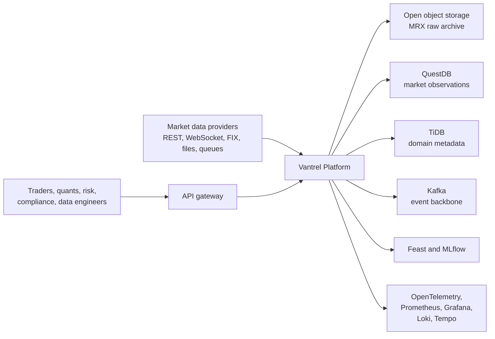

## Domain Decomposition

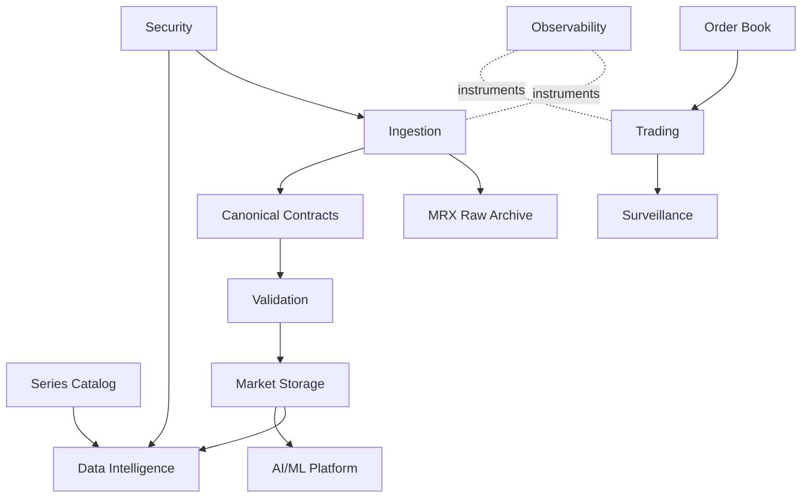

Primary domains:

- Ingestion captures external data and emits raw and canonical records.
- MRX preserves original provider payloads byte-for-byte.
- Canonical contracts define language-neutral events.
- Catalog owns series meaning, relationships and data products.
- Validation keeps invalid data traceable instead of silently dropping it.
- Market storage stores observations, not semantics.
- Trading and order-book services remain deterministic and replayable.
- Surveillance detects suspicious market and trading behavior with evidence.
- Data Intelligence exposes governed AI tools grounded in Catalog data.
- AI/ML provides models, features, experiments and recommendations.
- Security handles identity, authorization and policy enforcement.
- Observability exposes traces, metrics, logs and health.

## Data Architecture

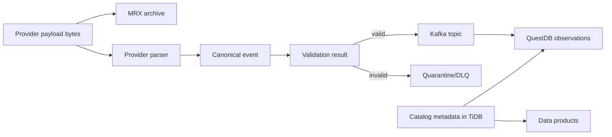

QuestDB stores time-series values and observations. It does not define what a series means.

TiDB stores transactional/domain metadata such as catalog, trading and compliance state. These domains may share an engine but must not be coupled into one schema.

Object storage stores raw MRX archives separately from normalized market storage.

## Ingestion Architecture

Live, historical and replay processing share the same core pipeline.

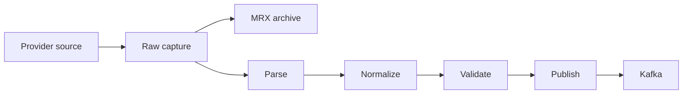

Provider adapters handle authentication, protocol, endpoint behavior, pagination, provider sequence handling and rate limits.

The ingestion runtime handles retries, backoff, circuit breaking, rate limiting infrastructure, backpressure, checkpointing, idempotency, raw archival, logs, metrics, traces, health, graceful shutdown, validation integration, normalization integration, Kafka publishing and quarantine.

## Raw Archival Architecture

MRX, Market Raw eXchange, is Vantrel's raw archival format.

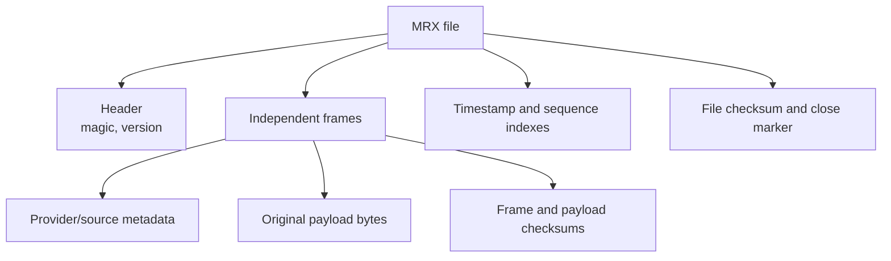

MRX must support byte-perfect recovery, replay, evidence, backloading, debugging and corruption detection. It does not replace Protobuf, Arrow, Parquet or QuestDB.

## Catalog Architecture

The Catalog owns data meaning.

```mermaid
erDiagram
    PROVIDER ||--o{ SOURCE : owns
    SOURCE ||--o{ SERIES : publishes
    SERIES ||--o{ SERIES_VERSION : versions
    SERIES ||--o{ SERIES_RELATIONSHIP : from
    SERIES ||--o{ SERIES_RELATIONSHIP : to
    DATA_PRODUCT ||--o{ DATA_PRODUCT_MEMBER : contains
    SERIES ||--o{ DATA_PRODUCT_MEMBER : included_in
```

Catalog entities include providers, sources, series, series versions, relationships, data products, data product members, purpose classifications and validation profile references.

Series definitions are versioned and auditable. Dynamic health belongs to Series Status, not static metadata.

## Forecast Vs Actual Model

Forecasts and realized observations are separate semantic categories.

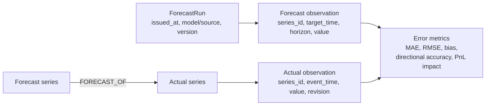

Forecast points reference a coherent ForecastRun. Forecast series link to actual series through Catalog relationships.

## Data Intelligence Architecture

Data Intelligence is a governed domain for AI-assisted data understanding, discovery and dataset construction.

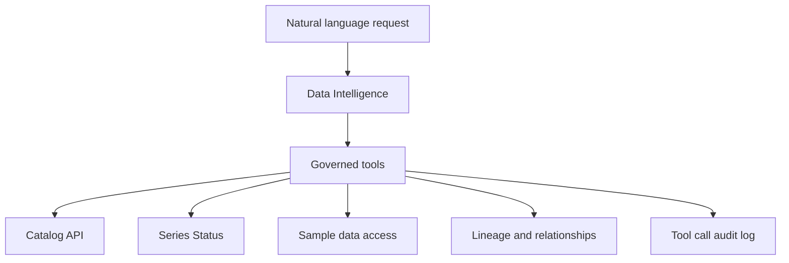

Tools include `search_series`, `get_series`, `get_series_health`, `get_series_relationships`, `compare_series`, `get_series_coverage`, `get_quality_metrics`, `get_data_product`, `get_data_lineage`, `get_sample_data` and `build_candidate_dataset`.

AI recommendations must be grounded in series that exist in the Catalog and must respect authorization.

## AI/ML Architecture

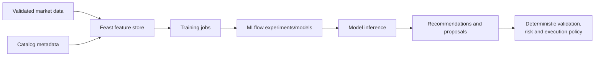

Traditional ML should be used where appropriate. LLMs do not replace numerical models for forecasting, volatility, anomaly detection, order-flow prediction or portfolio optimization.

## Trading Architecture

AI may analyze, predict, recommend, propose and explain. It may not bypass authentication, authorization, risk limits, portfolio constraints or execution controls.

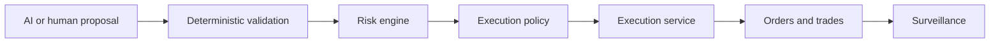

## Order-Book Recovery

The order book is planned for C++ and must be deterministic.

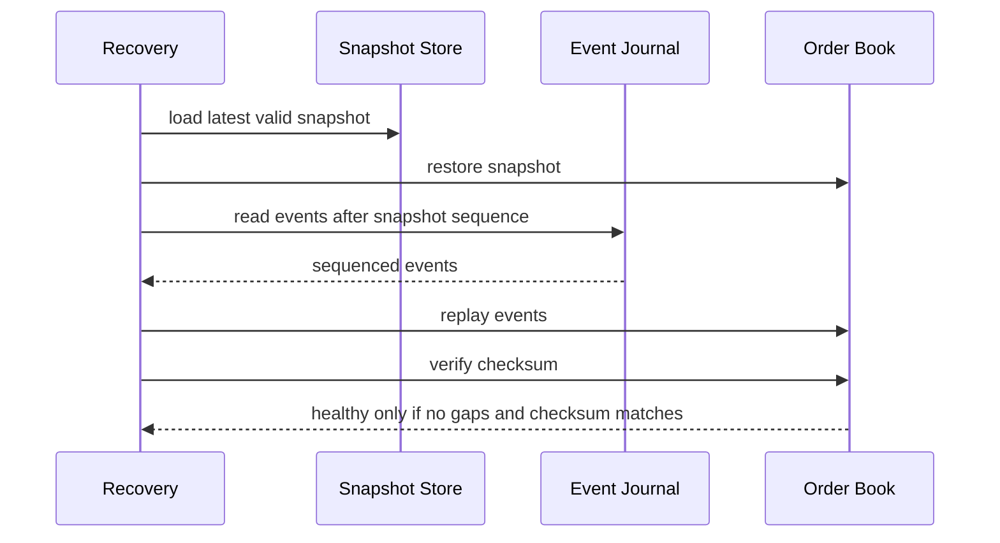

A book with a sequence gap must not remain healthy.

## Security Architecture

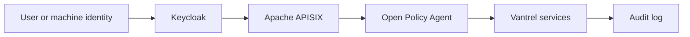

Roles should include Trader, Quant, Risk Manager, Compliance, Data Engineer, Administrator, Read Only and AI/machine identities.

## Observability Architecture

OpenTelemetry is the instrumentation standard.

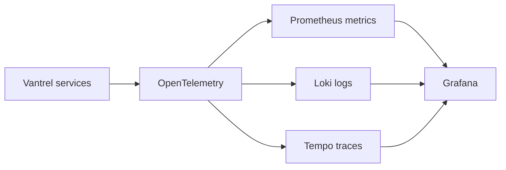

Important IDs should propagate where appropriate: `trace_id`, `correlation_id`, `ingestion_id`, `raw_record_id`, `canonical_event_id`, `series_id`, `forecast_run_id`, `order_id` and `trade_id`.

## Kubernetes Architecture

Vantrel is Kubernetes-first. Docker Compose is not the primary development runtime.

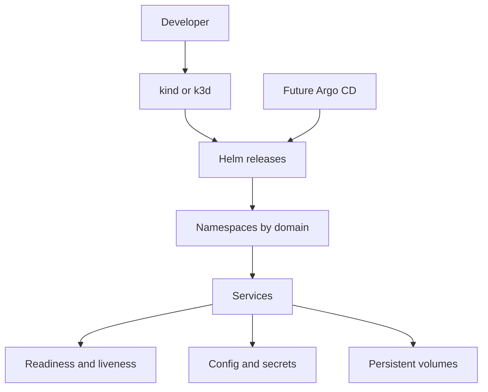

Local development should use kind or k3d, Helm conventions, health checks, resource requests/limits, graceful shutdown and documented configuration.
